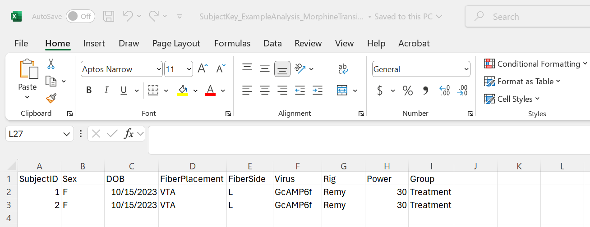
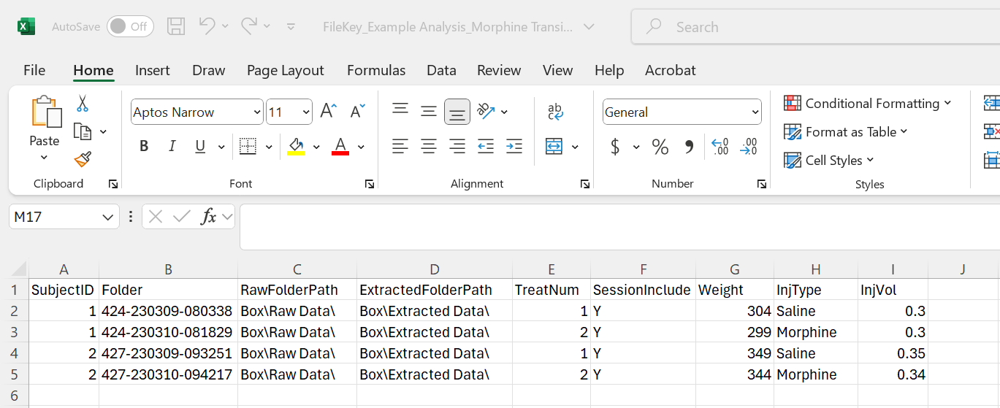
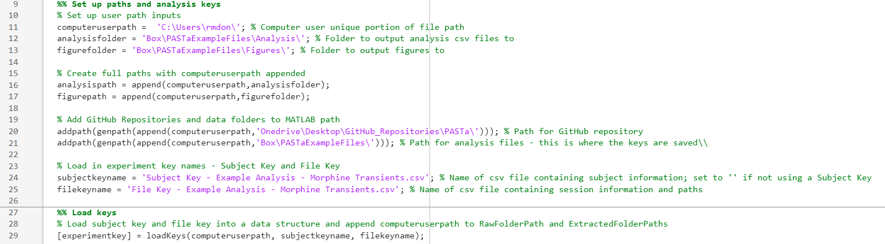

# Data Preparation
The first stage in the PASTa Protocol is data preparation, which involves associating fiber photometry data with experimental meta data, loading raw data, and extracting and saving the raw data as MATLAB data structures to faciliate future analysis sessions. For data collected with Tucker Davis Technologies equipment and software _Synapse_, custom functions are included to extract data from raw formats. 

For data collected with other systems, data must be pre-formatted to match a generic csv file format structure and loaded with provided custom functions, or prepared separately by the user. If your data doesn't match the available load options, please feel free to reach out!

## Data Organization 
The PASTa protocol is set up to accomodate any kind of file organization preferred by the user. Organization preference may vary depending on your lab's file storage practices, photometry equipment, or individual projects.

### TDT Synapse Output
Fiber photometry data collected through the software _Synapse_ (Tucker Davis Technologies) is stored in __tanks__ and __blocks__. __Tanks__ are parent folders created by Synapse for each experiment. __Blocks__ are individual folders for each session containing the actual output data. Stored data cannot be accessed directly via the folder, but rather must be extracted via MATLAB.

By default, the tank path is: C:\TDT\Synapse\Tanks. Synapse recognizes experiments and subjects as key categories of information that play a special role in managing data storage and retrieval. Thus, when running the session, it is critical to ensure the correct Experiment profile is selected, and the correct Subject identifier is input for each session. By default, Synapse names data tanks automatically based on experiment name and the start time of the first recording {ExperimentName}-{yymmdd}-{hhmmss}. Blocks of data are named based on subject {SubjectName}-{yymmdd}-{hhmmss} for each recording session and the start time.

Synapse will save a new Tank for every day unless you change the default setting. Click _Menu_ at the top of the bar, then Preferences. Under the _Data Saving_ tab, make sure "New Tank Each Day" is unchecked.

## Experiment Key Creation
To accomodate a variety of file organization structures, users can first create two csv files containing the information necessary to access raw data, and experimental metadata to match to raw photometry data. MATLAB can access raw data folders stored either locally or in a cloud-based storage app like Box or Dropbox. 

To faciliate analysis, users can create two keys as csv files: a subject key and a file key. In the PASTa protocol, these files will be knit together to pair subject specific information with each individual session of data, preventing the need for manual repeated entry of subject specific information and reduce the time burden of properly maintaining and including experimental metadata factors like subject traits, treatments, and experimental equipment.

First, locate the raw files to be analyzed in your file organization structure. Prepare a folder for extracted raw data to be saved to. This should be separate from your tank folder / raw data storage, and will eventually contain the extracted data sets for each session as MATLAB structures to facilitate efficient data processing in future analysis sessions.

### Subject Key
The subject key should contain information about each subject that is constant and unchanging, such as SubjectID, sex, date of birth, fiber location, sensor, experimental group, and any other user specificed information. 

__For example:__

### File Key
The file key should contain information about each unique session / file to be analyzed. At a minimum, this must include the SubjectID, folder name, raw folder location, and desired location for the raw data to be exported to.

- __SubjectID:__ Unique identifier of the subject. This fieldname should match the first field in the subject key, and inputs for each subject have to match the subject key for subject specific data to be properly associated to fiber photometry data.

- __Folder:__ The name of the folder containing the raw data.

- __RawFolderPath__: The path to the location where the raw data folder is saved for each specific session. All file paths should be specified in the file key WITHOUT the computer user specific portion of the path. This facilitates analysis across multiple devices or cloud storage solutions without manual edits to the file key. Ensure the specified path ends in a forward slash. __For example__, a file saved to a specific device at the path _"C:\Users\rmdon\Box\RawData\"_ should be specified as  _"Box\RawData\"_.

- __ExtractedFolderPath:__ The path to the location where you would like the extracted data structure to be saved. This should be different than the raw data storage location. All file paths should be specified in the file key WITHOUT the computer and user specific portion of the path. This facilitates analysis across multiple devices or cloud storage solutions without manual edits to the file key. Ensure the specified path ends in a forward slash. __For example__, a file saved to a specific device at the path _"C:\Users\rmdon\Box\ExtractedData\"_ should be specified as  _"Box\ExtractedData\"_.

 Any additional fields can be included such as equipment information, recording power, session condition, drug treatments, body weight, and any other variables that are specific to that one session. Note that the only field name that should overlap with a field name in the subject key is _SubjectID_.
    

__For example:__

### Making the Experiment Key
The function _loadKeys_ joins the individual subject information to the file key with the data for each session. Additionally, _loadkeys_ appends the unique computer user portion of the file navigation path to the beginning and the Folder name to the end of the raw and extracted folder paths specified in the file key. This creates the full path to the location of each session's data. __For example,__ _"C:\Users\rmdon\Box\RawData\Subject1-240101-121500"_. The created experiment key should be output into a data structure called _experimentkey_.

__Code example:__

## Extracting the Data
Prior to beginning analysis, individual session data should be extracted and saved as MATLAB data structures. This makes the process of loading data at the start of each analysis session significantly faster. Two options are available to extract the data, and should be used depending on the method by which the data was collected, both documented in detail below. Data collected with TDT can be extracted with custom functions. For all other systems, utilize the generic csv format: for d

If data were collected with TDT's Synapse, use the function _loadTDTdata_. If data were collected with other systems, use the generic format and load function _loadCSVdata_.

To load TDT data, use the function __extract
### Set up inputs

"C:\Users\rmdon\Box\RawData\Subject1-240101-121500"
