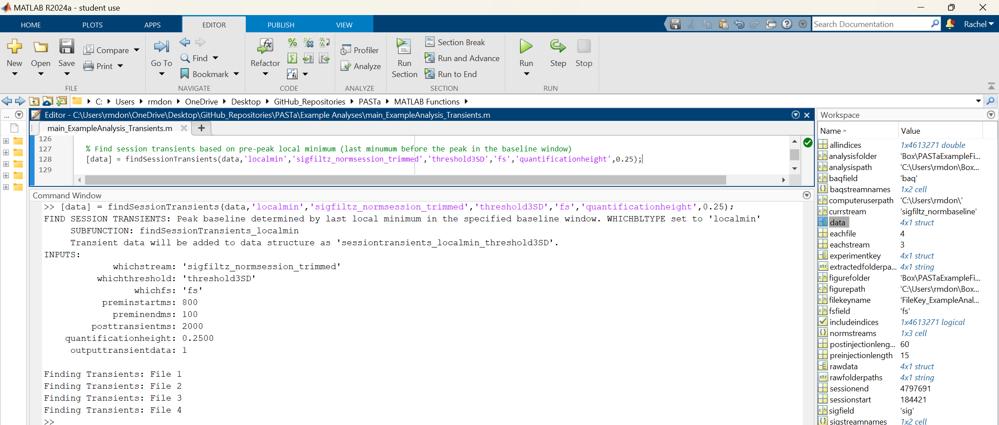
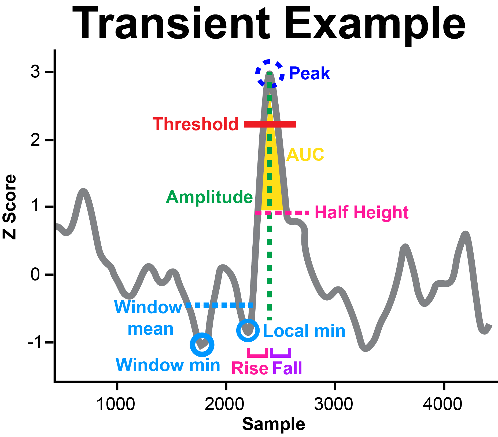
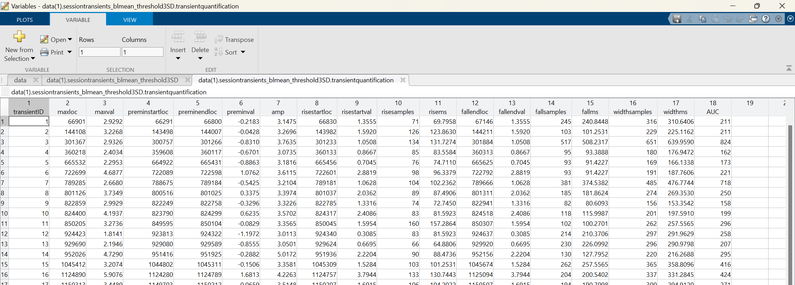
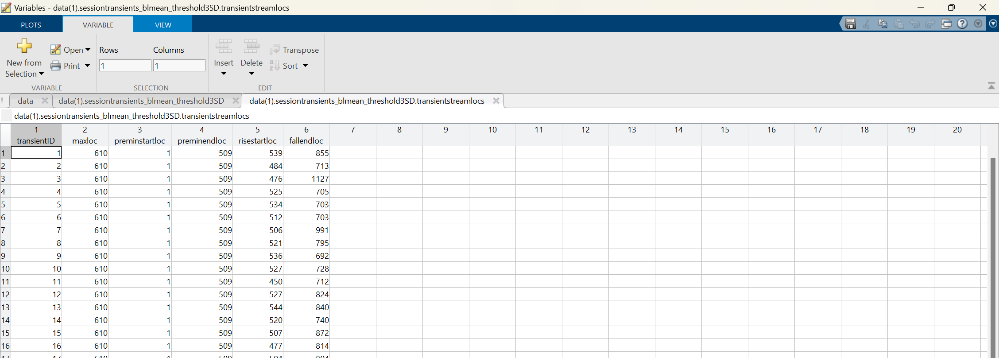

# Transient Detection and Quantification
Transient detection is a critical component of fiber photometry analyses, identifying relevant increases in sensor activation. Previous tools and packages have used a sliding window approach, where all values above an absolute threshold are counted as peaks. Here, we present a novel method of peak detection where each peak is compared to a local baseline and amplitude is calculated and compared to a threshold to determine inclusion. This allows for consistent parameters across the session and reliable detection of individual events despite signal absolute value fluctuation.

## Transient Event Detection
Transients are detected as peaks with a greater amplitude than the specified threshold. To determine amplitude, first a pre-peak baseline must be identified.

PASTa includes three options: window minimum (minimum value within user defined pre-peak window size, e.g. 800ms), window mean (mean of user defined pre-peak window), or local min (absolute local minimum preceding the peak). The amplitude threshold is set by the user, and recommended to be 3SDs. If data are normalized in Z scores, then the criterion is an increase of 3 from baseline. If not, the user inputs the actual value that corresponds to 3SDs in the data stream.

### Prepare Thresholds
Prior to detecting session transients, users must prepare the thresholds to be used for event detection. Transients are detected as peaks with a greater amplitude than the specified threshold. The amplitude threshold is set by the
user, and recommended to be 3SDs. If data are normalized in Z scores, then the criterion is an increase of 3 from baseline. If not, the user inputs the actual value that corresponds to 3SDs in the data stream.

Users must add the thresholds to each row of the data structure prior to moving on.

__Code example:__ Preparation of 'threshold3SD' field in data structure containing the value 3 for each row of data. Thresholds are set to the numeric value 3 because transients will be identified in Z scored data streams.

### _Function:_ findSessionTransients

Finds transients for the whole session. Pre-transient baselines can be determine as pre-peak baseline window minimum, pre-peak baseline window mean, or local minimum preceding the peak within the baseline window.

__NOTE:__ The _findSessionTransients_ function sets default values for optional input parameters and then calls subfunctions for each type of peak baseline. Note that if you'd prefer to directly call the sub-function desired, all inputs are required and defaults are not specified.

__REQUIRED INPUTS:__

- __data:__ This is a structure that contains at least the data stream you want to analyze for transient events.

- __whichbltype:__ A string specifying the the type of pre-transient baseline to use for transient amplitude determination and inclusion,and event quantification. Default: 'blmin'
    - _'blmin':_ Pre-transient baselines are set to the minimum value within the pre-transient window.
    - _'blmean':_  Pre-transient baselines are set to the mean of the pre-transient window.
    - _'localmin':_  Pre-transient baselines are set to the local minimum directly preceding the transient within the baseline window.

- __whichstream:__ A string with the name of the field containing the stream to be analyzed for transients. For example, 'sigz_normsession'.

- __whichthreshold:__  A variable containing a string with the name of the field containing the prepared numeric threshold values for each stream. For example, 'threshold_3SD'. 
    - __NOTE:__ Threshold values should be calculated before using the findSessionTransients functions. Typically thresholds are set to 2-3 SDs. If the input data stream is Z scored, this can be the actual SD threshold number. If the input data stream is not Z scored, find the corresponding value to 2-3 SDs for each subject.

- __whichfs:__ A string with the name of the field containing the sampling rate of the streams. For example, 'fs'.

__OPTIONAL INPUTS:__

- __preminstartms:__ Number of millseconds pre-transient to use as the start of the baseline window. Default: 1000

- __preminendms:__ Number of millseconds pre-transient to use as the end of the baseline window. Default: 100

- __posttransientms:__ Number of millseconds post-transient to use for the post peak baseline and trimmed data output. Default: 2000

- __quantificationheight:__ The height at which to characterize rise time, fall time, peak width, and AUC. Must be a number between 0 and 1. Default: 0.5

- __outputtransientdata:__ Set to 1 to output cut data streams for each transient event. Set to 0 to skip. Default: 1

__OUTPUTS:__

- __data:__ The original data structure with sessiontransients_WHICHBLTYPE_THRESHOLDLABEL added in. The output contains four nested tables:
    - _inputs:_ Includes all required and optional function inputs. If optional inputs are not specified, defaults will be applied.
    - _transientquantification:_ Includes the quantified variables for each transient, including amplitude, rise time, fall time, width, and AUC. See _Transient Quantification_ section below for addition details on quantification outputs.
    - _transientstreamlocs:_ Pre-transient baseline, transient peak, rise, and fall locations for each transient to match the cut transient stream data.
    - _transientstreamdata:_ Cut data stream from baseline start to the end of the post-transient period for each transient event.
    - __NOTE:__ For all data outputs, each transient is in a separate row. If OUTPUTTRANSIENTDATA is set to anything other than 1, the TRANSIENTSTREAMLOCS and TRANSIENTSTREAMDATA tables will be skipped and not included in the output.

__Code example:__ Whole session transient detection with baseline minimum and default inputs

__Code example:__ Whole session transient detection with baseline mean and shortened pre-peak baseline window

__Code example:__ Whole session transient detection with local minimum and 25% quantification height

## Transient Event Quantification
Multiple features of transient events can be quantitatively analyzed and compared. Peak detection functions automatically calculate numerous variables for each transient to characterize aspects of both event rise and fall. PASTa includes flexible functions to group transients in the most experimentally relevant manner, such as by time window or experimental condition. 

* __Frequency:__ Characterized as peaks per minute. Frequency can be analyzed as whole session frequency, or peaks can be divided into time bins or experimental phases (ITI, during trial, etc).

* __Amplitude:__ The height of the event from the pre-peak baseline to the max peak. Note that all events will be at least the value of the set threshold (default 3SD).

* __Rise and Fall Time:__ Transient rise and fall are measured by default from half height to peak and output in samples and ms. This allows for analysis of separate rise and fall dynamic shifts. The quantification height to be measured from can be manually adjusted if desired.

* __Width:__ Transient width is measured as the width from the pre-peak quantification height (defaults to half height) location to the post-peak quantification height location. This is equivalent to the rise plus the fall.

* __AUC:__ Total area under the curve from half height to peak, calculated via the trapezoidal method. Prior to AUC calculation, each transient is linearly transformed so pre-peak baseline is equal to zero. If the height to be measured from is adjusted for rise and fall time, it will also be adjusted for AUC.

__Figure 6:__ Transient example with labeled detection parameters and output variables. 

### _Function Outputs:_ findSessionTransients
findSessionTransients adds numerous transient quantification values to the data structure for easy output and flexible analysis. 

__VARIABLES:__
- __transientID:__ Unique integer ID for each transient identified. IDs start at 1.

- __maxloc:__ Stream index of the maximum transient peak value.

- __maxval:__ Maximum transient peak value.

- __preminstartloc:__ Stream index of the start of the pre-peak baseline window.

- __preminendloc:__ Stream index of the end of the pre-peak baseline window.

- __preminloc:__ Only included in 'blmin' and 'localmin' outputs. Stream index of the actual pre-peak baseline.

- __preminval:__ Value of the pre-peak baseline. For 'blmin' and 'localmin', this will be the actual value. For 'blmean', this will be the mean of the baseline window.

- __amp:__ Amplitude of the transient (maxval - preminval).

- __risestartloc:__ Stream index of the start of the rise period of the transient, determined by the quantification height. This value is identified as the sample before the peak closest to the preminval + (amp * quantification height).

- __risestartval:__ Value of the start of the rise period of the transient.

- __risesamples:__ Length of the transient event rise period in samples. This is calculated as the maxloc - risestartloc.

- __risems:__ Duration of the transient event rise period in ms.

- __fallendloc:__ Stream index of the end of the fall period of the transient, determined by the quantification height. This value is identified as the sample after the peak closest to the maxval - (amp * quantification height).

- __fallendval:__ Value of the end of the fall period of the transient.

- __fallsamples:__ Length of the transient event fall period in samples. This is calculated as the fallendloc - maxloc.

- __fallms:__ Duration of the transient event fall period in ms.

- __widthsamples:__ Total width of the rise and fall of the transient event. Number of samples from the rise start to the fall end locations.

- __widthms:__ Total duration of the rise and fall of the transient event in ms.

- __AUC:__ Area under the curve from the quantification height to the transient peak. Calculated via the trapezoidal method.

__Output Example: Adding Transients to the Data Structure__ Output of findSessionTransients, which is a sub-structure under the field _sessiontransients_ added to the main data structure.

__Output Example: Function Inputs__ Inputs passed to the findSessionTransients functions are output to the table _Inputs_ within the sessiontransients field of the main data structure.

__Output Example: Transient Quantification__ Quantification of individual transient events is output to the table _transientquantification_ within the sessiontransients field of the main data structure. Each transient is in a separate row with a unique transient ID.

__Output Example: Individual Transient Trace Indexes__ For individual transient traces, transient stream locations of peak and baseline indexes and values are added to the table _transientstreamlocs_. Each transient is in a separate row.

__Output Example: Individual Transient Traces__ Actual stream values for individual transient traces, which are cut from the start of the baseline window to the end of the post peak period, and output to the table _transientstreamdata_. Each transient is in a separate row, and traces are spatially aligned consistently with the _transientstreamlocs_ for easy plotting and analysis.

### Comparison of Transient Events with VTA GCaMP6f, NAcLS dLight1.3b, and NAcLS GRABDA2H
To validate our approach to transient detection, we analyzed identified transient events in dopamine recordings via three sensors: VTA GCaMP6f, NAcLS dLight1.3b, and NAcLS GRABDA2H.

__Figure 7:__ Transient detection and quantification examples for __A)__ GCaMP6f, __B)__ dLight1.3b, and __C)__ GRABDA2H. Transients were detected with a threshold of 3SD and an 800ms window minimum pre-peak baseline. Bar plots of group means by sensor for __D)__ average whole session peak frequency, __E)__ mean peak amplitude, __F)__ total peak rise time from pre-peak baseline to peak, G) rise time from half height to peak, H) fall time from peak to half height, and __I)__ half height AUC. Overall, individual sensor results align well with published kinetics.

